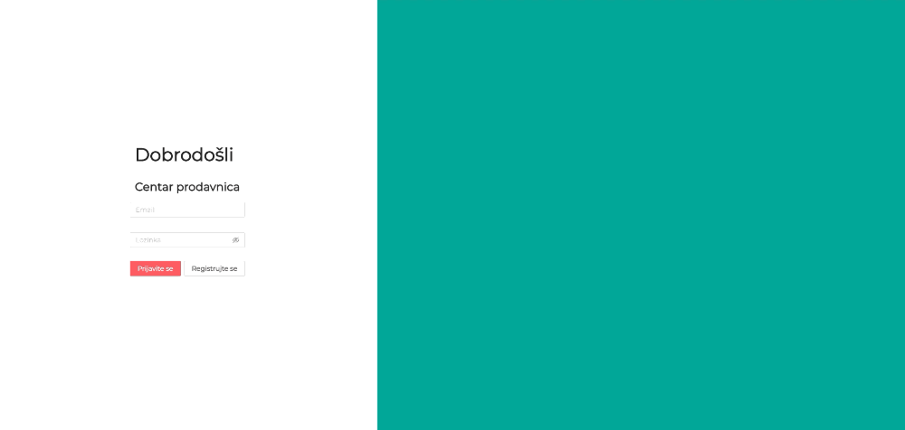
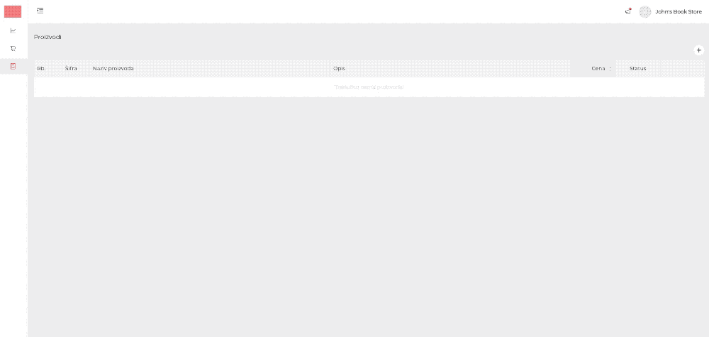

# MultiCommerce Stores

This application works only with integration with other repositories (MultiCommerce-Public, MultiCommerce-Backend).

It is platform for seling stuff as legitimate store to users registered on MultiCommerce-Public

Technologies used:
  - React
  - Redux
  - Redux Saga
  - SocketIO

Register your store and access Dashboard Panel.

You can add products with all informations with Products Module

When User make connection with you, you can communicate throught Messenger.

At the moment app have many defects that need to be improved:
 - Error Handling
 - Logging
 - Code refactoring
 - A lot of design improvements
### TO-DO:

 - Analitycs Module
 - Improve Orders Module
 - Add Employees Module
